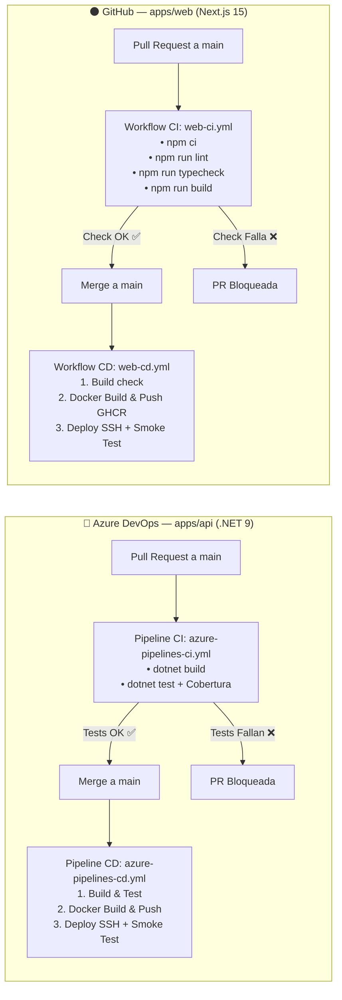

# Guía Maestra de Configuración CI/CD: API (Azure DevOps) & Web (GitHub)

Esta guía detalla paso a paso la configuración de la infraestructura de integración y despliegue continuo para ambos proyectos de StandUrl, asegurando que **ningún cambio se publique si no supera los tests y validaciones**.

---

## Resumen de la Arquitectura



---

# PARTE 1: Configuración de la API en Azure DevOps

## 1.1. Dar de Alta los Pipelines YAML

1. En Azure DevOps, accede a tu proyecto y navega a **Pipelines → Pipelines**.
2. Haz clic en **New Pipeline** (arriba a la derecha).
3. Selecciona la ubicación de tu repositorio (**Azure Repos Git** o **GitHub**).
4. Elige la opción **Existing Azure Pipelines YAML file**.
5. Configura los dos pipelines:

| Nombre Sugerido | Archivo YAML | Propósito |
| :--- | :--- | :--- |
| `StandUrl.Api - CI (PR Validation)` | [`/azure-pipelines-ci.yml`](file:///c:/Proyectos/StandUrl/azure-pipelines-ci.yml) | Se ejecuta en PRs. Valida build y ejecuta `dotnet test`. |
| `StandUrl.Api - CD (Deploy Prod)` | [`/azure-pipelines-cd.yml`](file:///c:/Proyectos/StandUrl/azure-pipelines-cd.yml) | Se ejecuta al hacer merge/push a `main`. Despliega a producción. |

---

## 1.2. Crear el Grupo de Variables (Variable Group)

1. Ve a **Pipelines → Library → + Variable group**.
2. Nombre del grupo: `standurl-api-secrets`
3. Añade las siguientes variables:

| Variable | Tipo | Ejemplo / Valor |
| :--- | :--- | :--- |
| `DOCKER_REGISTRY_URL` | Texto | `ghcr.io` o `docker.io` o tu ACR |
| `DOCKER_REGISTRY_USERNAME` | Texto | Tu usuario del registro |
| `DOCKER_REGISTRY_PASSWORD` | 🔒 Secreto | Token o contraseña del registro Docker |
| `SSH_HOST` | Texto | `51.195.47.36` |
| `SSH_USER` | Texto | Usuario del servidor (ej: `ubuntu` o `root`) |
| `SSH_PRIVATE_KEY` | 🔒 Secreto | Contenido completo de tu clave privada SSH |
| `SSH_PORT` | Texto | `22` |

> [!IMPORTANT]
> Asegúrate de hacer clic en el icono del candado 🔒 en las variables confidenciales para que no se muestren en texto plano ni en los logs.

---

## 1.3. Crear las Conexiones de Servicio (Service Connections)

Ve a **Project Settings** (esquina inferior izquierda) → **Service connections → New service connection**:

### A. Docker Registry Connection
- **Tipo**: `Docker Registry` → `Others` (o Docker Hub / ACR según corresponda).
- **Docker Registry**: `https://ghcr.io` o `https://index.docker.io/v1/`
- **Docker ID**: Tu usuario.
- **Docker Password**: Tu Personal Access Token (PAT) o contraseña.
- **Service connection name**: `standurl-registry` *(debe coincidir exactamente con el nombre en `azure-pipelines-cd.yml`)*.
- Marca la casilla **"Grant access permission to all pipelines"**.

### B. SSH Connection
- **Tipo**: `SSH`.
- **Host name**: `51.195.47.36`
- **Port number**: `22`
- **User name**: Usuario del servidor con permisos de Docker.
- **Private key**: Contenido de tu clave privada SSH.
- **Service connection name**: `standurl-server-ssh` *(nombre requerido por `azure-pipelines-cd.yml`)*.
- Marca la casilla **"Grant access permission to all pipelines"**.

---

## 1.4. Crear el Entorno (Environment)

1. Ve a **Pipelines → Environments → New environment**.
2. Nombre: `standurl-production`.
3. *(Opcional - Recomendado)*: Haz clic en los tres puntos `...` del entorno → **Approvals and checks** → **Approvals** → Añade tu usuario. Con esto, antes del despliegue final en producción, Azure DevOps te pedirá confirmación manual.

---

## 1.5. Bloquear Merge si fallan los Tests (Branch Policy)

> [!CAUTION]
> Este paso es fundamental para garantizar que nadie pueda fusionar a `main` código que rompa los tests.

1. Ve a **Repos → Branches**.
2. En la rama `main`, haz clic en los tres puntos `...` → **Branch policies**.
3. Activa **Require a minimum number of reviewers** si trabajas en equipo.
4. En la sección **Build Validation**, haz clic en **`+` (Add build policy)**:
   - **Build pipeline**: Selecciona `StandUrl.Api - CI (PR Validation)`.
   - **Path filter**: `apps/api/*;azure-pipelines-ci.yml`
   - **Trigger**: `Automatic`.
   - **Policy requirement**: **Required** *(Obligatorio)*.
   - **Build expiration**: `Immediately when main is updated`.
5. Guarda la política.

---

# PARTE 2: Configuración de la Web en GitHub

Los flujos de la aplicación web Next.js están definidos en:
- CI (Validación PR): [`.github/workflows/web-ci.yml`](file:///c:/Proyectos/StandUrl/.github/workflows/web-ci.yml)
- CD (Despliegue Prod): [`.github/workflows/web-cd.yml`](file:///c:/Proyectos/StandUrl/.github/workflows/web-cd.yml)

---

## 2.1. Configurar Secrets y Variables en el Repositorio

En GitHub ve a tu repositorio → **Settings → Secrets and variables → Actions**:

### A. Repository Secrets (Pestaña Secrets → New repository secret)

| Nombre del Secreto | Descripción |
| :--- | :--- |
| `DOCKER_REGISTRY` | `ghcr.io` (o `docker.io`) |
| `DOCKER_USERNAME` | Tu nombre de usuario en GitHub o Docker Hub |
| `DOCKER_PASSWORD` | GitHub PAT con permisos `write:packages` o token de Docker |
| `SSH_HOST` | IP del servidor (`51.195.47.36`) |
| `SSH_USER` | Usuario SSH con permisos de Docker |
| `SSH_PRIVATE_KEY` | Clave privada SSH |
| `SSH_PORT` | `22` |

### B. Repository Variables (Pestaña Variables → New repository variable)

| Nombre de la Variable | Valor |
| :--- | :--- |
| `NEXT_PUBLIC_API_URL` | `https://api.standurl.com` |
| `NEXT_PUBLIC_SITE_URL` | `https://standurl.com` |

---

## 2.2. Configurar el Entorno en GitHub

1. Ve a **Settings → Environments → New environment**.
2. Nombre: `production`.
3. *(Opcional)* Activa **Required reviewers** para requerir aprobación antes de desplegar.

---

## 2.3. Bloquear Merge si falla el CI en GitHub (Branch Protection)

Para impedir que se haga merge a `main` si falla el linting, chequeo de tipos o build:

1. Ve a **Settings → Branches** (o **Rules → Rulesets**).
2. Haz clic en **Add branch protection rule** (o **New ruleset**).
3. **Branch name pattern**: `main`.
4. Marca las siguientes opciones:
   - ✅ **Require a pull request before merging**.
   - ✅ **Require status checks to pass before merging**.
   - En la barra de búsqueda de checks, busca y selecciona:
     - `Lint & Build` *(nombre del job en `web-ci.yml`)*.
   - ✅ **Require branches to be up to date before merging**.
5. Guarda los cambios (**Save changes**).

---

# PARTE 3: Configuración del Servidor de Producción (`51.195.47.36`)

En el servidor remoto, la carpeta `/opt/standurl` debe contener la estructura de Docker Compose lista para recibir los despliegues.

```bash
# 1. Crear directorio del proyecto
sudo mkdir -p /opt/standurl
cd /opt/standurl

# 2. Copiar el archivo docker-compose.prod.yml de tu repositorio
# Asegúrate de que los servicios 'api' y 'web' tengan configurada la política de restart y sus puertos.

# 3. Autenticar Docker con el registro (una sola vez)
echo "TU_TOKEN_O_PASSWORD" | docker login ghcr.io -u TU_USUARIO --password-stdin
```

---

# Checklist de Verificación Final

- [ ] **API (Azure DevOps)**:
  - [ ] Pipeline CI creado y vinculado a `azure-pipelines-ci.yml`.
  - [ ] Pipeline CD creado y vinculado a `azure-pipelines-cd.yml`.
  - [ ] Variable group `standurl-api-secrets` creado con todas las credenciales.
  - [ ] Service Connections `standurl-registry` y `standurl-server-ssh` autorizadas.
  - [ ] Branch policy en `main` activada con Build Validation obligatoria.
- [ ] **Web (GitHub)**:
  - [ ] Actions Secrets configurados (`SSH_*`, `DOCKER_*`).
  - [ ] Variables públicas configuradas (`NEXT_PUBLIC_*`).
  - [ ] Branch Protection Rule en `main` exigiendo que el check `Lint & Build` pase.
- [ ] **Servidor**:
  - [ ] Directorio `/opt/standurl` creado con `docker-compose.prod.yml`.
  - [ ] Docker y permisos SSH verificados.
